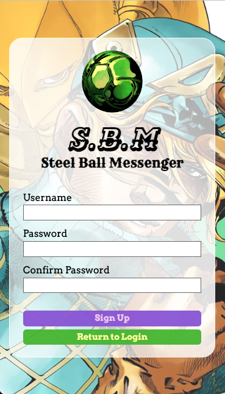

<h1 align="center">Steel Ball Messenger</h1>
<h3 align="center">Message your friends to the theme of Steel Ball Run by Araki Hirohiko</h3>
<p align="center">
    
</p>

### Description

-   Message your friends by creating chats
-   Personalize your account with a custom bio

### Features

-   Account signup and authorization
-   Messages, chats, and bio saved on database
-   Creating chats between two accounts
-   Profiles for every account
-   Latest message shown for each chat shown on chats page
-   Search bar for filtering chats and users
-   Neat login / signup / loading animations
-   Mobile and Desktop design
-   Toast alerts designed by ME! I DID IT!
-   Neat design 8) Cool art!

### App Showcase

| Mobile overview (gif)                            |
| ------------------------------------------------ |
|  |

| Send Message, latest message, search (gif)                     |
| -------------------------------------------------------------- |
|  |

| View other user profile (gif)                        |
| ---------------------------------------------------- |
|  |

| Edit bio (gif)                                   |
| ------------------------------------------------ |
|  |

| Login (gif)                                  | Logout                                         |
| -------------------------------------------- | ---------------------------------------------- |
|  |  |

### Server Stack

-   NodeJS, Express
-   Prisma ORM, PostgreSQL
-   Other libraries
    -   Jsonwebtoken
    -   dotenv
    -   express-validator

### Frontend Stack

-   React (Vite), JSX
-   CSS Modules
-   libraries
    -   react-router
    -   motion
    -   date-fns

### Endpoints

| METHOD | URI                     | Function                       | Body                  | Notes                |
| ------ | ----------------------- | ------------------------------ | --------------------- | -------------------- |
| POST   | /login                  | Login user                     | { username, password} |                      |
| GET    | /current                | Get current user data          | token                 | id, username, bio    |
| PATCH  | /current                | Update user profile            | token, { bio }        |                      |
| GET    | /users                  | Retrieve all user              | token                 |                      |
| POST   | /users                  | Create user                    | { username, password} | creates user profile |
| GET    | /users/:userId/profiles | Retrieve user profile          |                       |                      |
| GET    | /chats                  | Retrieve all chats for user    | token                 |                      |
| POST   | /chats                  | Create chat between >= 1 users | token, { users }      | chat: { id, users}   |
| GET    | /chats/:chatId          | Retrive chat messages          | token                 |                      |
| POST   | /chats/:chatId/messages | Create chat message            | token, { content }    |                      |

### Learning Outcomes

-   Backend

    -   using prisma connect to connect two models! neato

-   Frontend

    -   One page design
    -   Font face font-weights (didn't know i could set those)
    -   "Scroll" to newest message by using flex column-reverse and rendering messages in reverse order
    -   First time implement search filtering! It was fun
    -   First time using CSS libraries (Motion)
        -   Motion is very fun and easy to use! I will use it for my future projects for sure

### Retrospective aka yapping

-   Although not my favorite project, I learned the most from this one
    -   I would like to plan out the architecture of my frontend more clearly before coding!
-   I got burned by not planning my frontend design
    -   Original prototype was ugly and was not fun to code
    -   Final design was not up to my standard for design
    -   However: This is my first time doing a one page navigation
        -   Mobile-ish first design! Looks like an app haha
        -   I am proud for experimenting with doing one, even if my implementation could use some work
    -   Actionable items
        -   Spend a day designing the frontend before coding frontend!
-   I tried implement backend and frontend at the same time again. I would make a basic UI after completing each backend feature (just enough to use the backend).
    -   pros:
        -   Actually using each backend route is useful because it shows what data to return and what is not needed
    -   cons:
        -   I really do not like creating an ugly UI (it hurts my soul)
        -   I tried incorporating some of the prototype into my final design. (BAD IDEA IT WAS NOT GOOD CODE CUZ IT WAS A PROTOTYPE)
    -   Takeaways: I will continue this process but treat the basic frontend as a prototype and delete it after backend is "complete"
-   getting confident using prisma select and include
-   Proud: custom "liquid glass" card stying
-   Learning to prioritize fixes. Critical first, non pertinent later

### Start commands

```bash
# Start backend server
cd backend
npm install
node app.js
```

```bash
# Start frontend react
cd frontend
npm install
npm run dev
```

### Acknowledgements

| Usage  | Source                                                                                              |
| ------ | --------------------------------------------------------------------------------------------------- |
| Images | Araki Hirohiko                                                                                      |
| Icons  | icons8.com                                                                                          |
| Specs  | [The Odin Project](https://www.theodinproject.com/lessons/nodejs-where-s-waldo-a-photo-tagging-app) |
